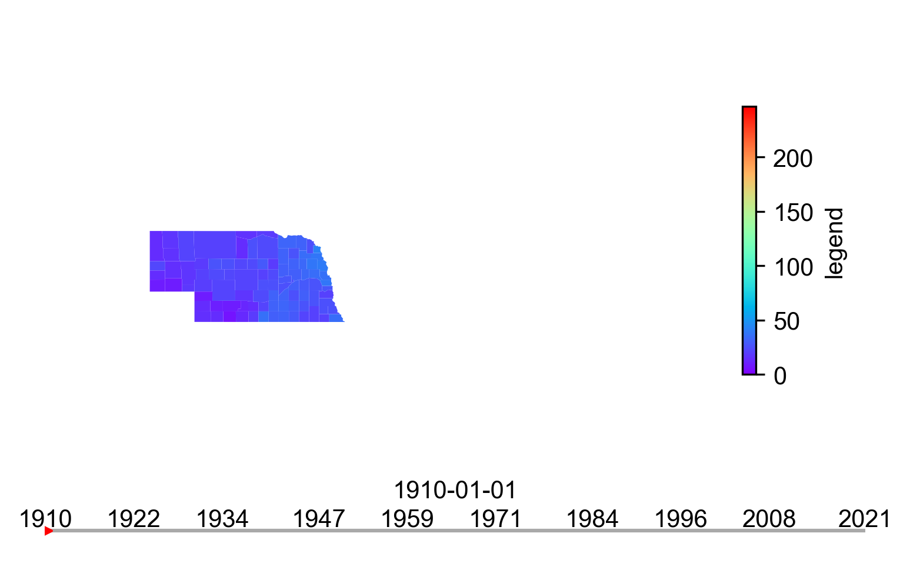
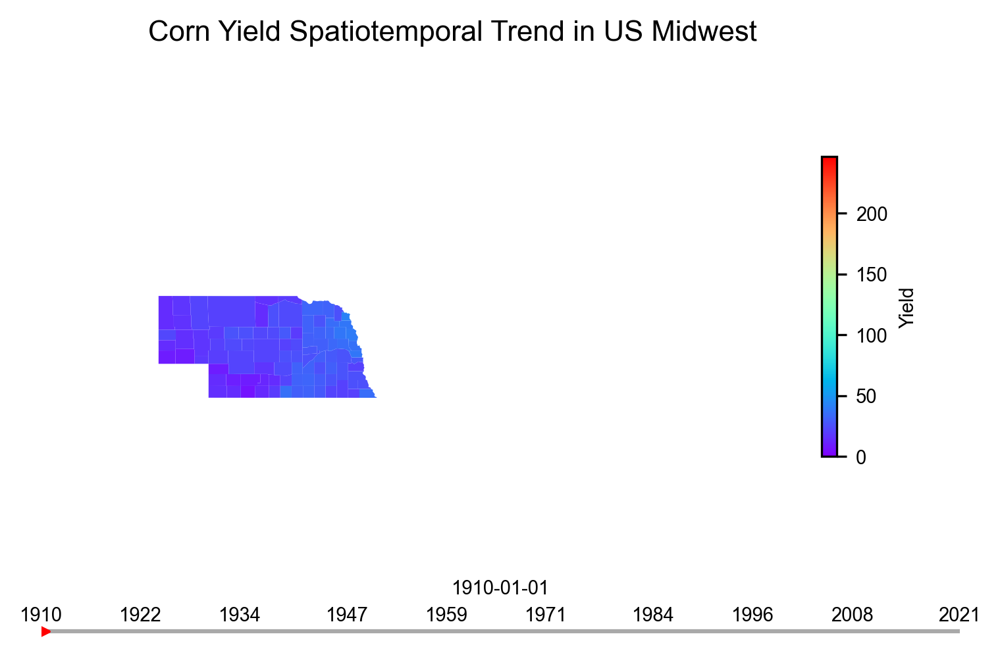
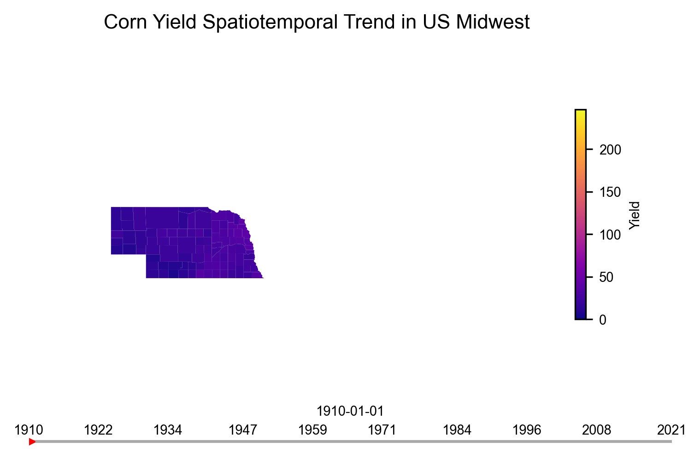

Example 1: Corn Yield Timelapse in the Midwest (Choropleth Map)
===============================================================

In this example, we will create an animation that shows how different
counties in the Midwestern region of the United States have evolved in
the overeall Corn Yield. The US Midwest is generally considered as the
Corn Belt as most of the corn is produced in this region. The USDA also
maintains a county level yield information for each year starting from
as early as 1910. Therefore, the animated timelapse can be interesting
in revealing the pattern of yield change over time.

Dataset
-------

To make an animated map using ``MapLapse``, we will need two types of
information. First, a shapefile that shows the counties of the
midwestern region in the US. Second, a ``csv`` file that has the
temporal data to visualize. Another important information is to have a
unique ID that can connect both the shapefile and the ``csv`` file.

The dataset for this example can be downloaded from
`here <https://drive.google.com/drive/folders/1-QMiPf-STf8zTidPYEQl1DJouXsaTqi8?usp=sharing>`__.
You will find a shapefile named ``county_shape.shp`` (which is
downlaoded from the TIGER Census dataset) and a csv file called
``century_data.csv``. The csv file was downloaded from `USDA NASS Data
and Statistics <https://www.nass.usda.gov/Data_and_Statistics/>`__
website. You can choose from other agricultural statistics and rearrange
the dataset accordingly. However, for this example the dataset is
already processed in a nice csv file. Here, the unique ID to make a
connection with the counties and the csv file is a combined field of
State and County name. Here I concatenated the State and County name
with a ’_’ in between them. However, you can do any way you want, but do
this before workign with ``MapLapse``.

Animation
---------

Import the ``Animator`` object from ``maplapse``.

.. code:: ipython3

    from maplapse import Animator

Define the ``Animator`` object with necessary parameters. Here we are
doing a ``choropleth`` map.

.. code:: ipython3

    anim = Animator(shape='/Users/sbhadra/maplapse/data/corn_yield/county_shape.shp',
                    value='/Users/sbhadra/maplapse/data/corn_yield/century_data.csv',
                    time_column='Year',
                    data_column='Value',
                    shape_unique_column='ST_CNT',
                    map_type='choropleth',
                    out_path='/Users/sbhadra/maplapse/data/corn_yield/animation.gif')

When the ``animate`` method is invoked on the ``Animator`` object, it
process every frame and saves it as either a gif or mp4 video file.
However, before doing that, we might want to check if the other
components of the map looks ok by looking at individual frames. We can
invoke the ``view_frame`` methods which just shows one frame and we can
update our ``Animator`` object accordingly.

.. code:: ipython3

    anim.view_frame()

To me, everything looks good. However, before proceeding, we might want
to refurbish several things, i.e., map title, legend title, and reducing
the font size a little bit. Those options can executed as the optional
kwargs. Let’s update the ``Ainmator`` based on those changes.

.. code:: ipython3

    anim = Animator(shape='/Users/sbhadra/maplapse/data/corn_yield/county_shape.shp',
                    value='/Users/sbhadra/maplapse/data/corn_yield/century_data.csv',
                    time_column='Year',
                    data_column='Value',
                    shape_unique_column='ST_CNT',
                    map_type='choropleth',
                    out_path='/Users/sbhadra/maplapse/data/corn_yield/animation.gif',
                    map_title="Corn Yield Spatiotemporal Trend in US Midwest",
                    legend_title='Yield',
                    font_size=7)

.. code:: ipython3

    anim.view_frame()

Much better. You can explore other optional features. Let’s change the
colormap of the animation. By default, it is set at ``rainbow``. But you
can change it to anu matplotlib cmap styles. For an entire list, please
see
`here <https://matplotlib.org/stable/tutorials/colors/colormaps.html>`__
for reference. Now, let’s change it to ``plasma``.

.. code:: ipython3

    anim = Animator(shape='/Users/sbhadra/maplapse/data/corn_yield/county_shape.shp',
                    value='/Users/sbhadra/maplapse/data/corn_yield/century_data.csv',
                    time_column='Year',
                    data_column='Value',
                    shape_unique_column='ST_CNT',
                    map_type='choropleth',
                    out_path='/Users/sbhadra/maplapse/data/corn_yield/animation.gif',
                    map_title="Corn Yield Spatiotemporal Trend in US Midwest",
                    legend_title='Yield',
                    font_size=7,
                    cmap='plasma')

.. code:: ipython3

    anim.view_frame()

To create the final animation, we can either do a gif or mp4 video. The
gif is great as it is lightweight, takes fewer time to creata and easy
to share online. However, a caveat of gif is that it cannot handle lots
of color variation. In that case, mp4 is the best option. We have
already defined that the ``out_path`` argument as gif on its extension.
However, to ``animate``, we can control how fast the animation will look
like.

.. code:: ipython3

    anim.animate(duration=0.1)

.. parsed-literal::

    100%|██████████| 112/112 [00:58<00:00,  1.92it/s]

